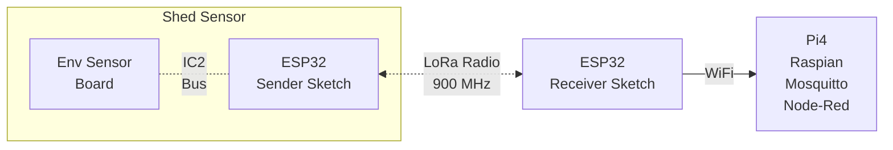
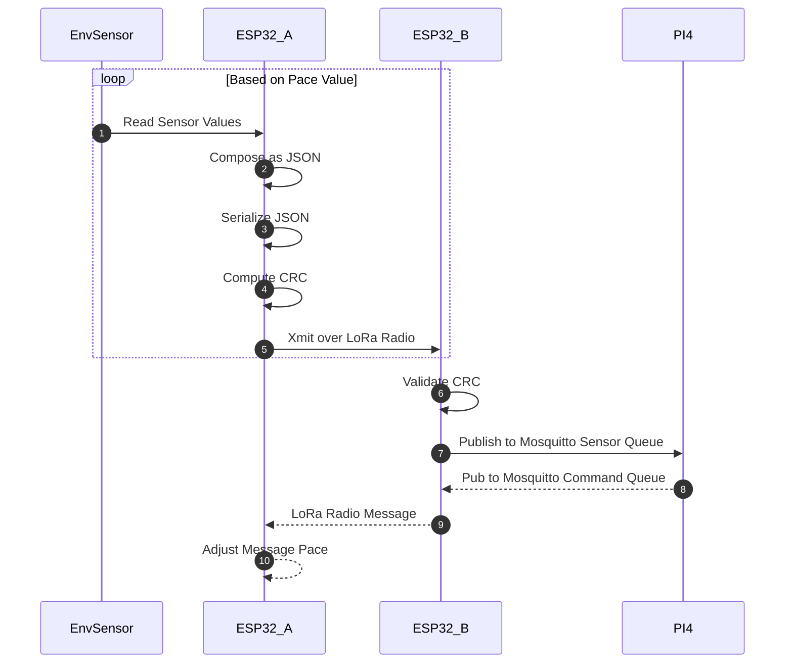

### Block Diagram

```mermaid
flowchart LR;
    subgraph Shed Sensor 
	  B[Env Sensor\nBoard]-.-|IC2\nBus|S[ESP32\nSender Sketch]	
    end
	  S<-.->|LoRa Radio\n900 MHz|R[ESP32\nReceiver Sketch]
    R-->|WiFi|P[Pi4\nRaspian\nMosquitto\nNode-Red]
```

 

## Event Sequence

```mermaid
sequenceDiagram
    autonumber
	  loop Based on Pace Value
      EnvSensor->>ESP32_A: Read Sensor Values
      ESP32_A->>ESP32_A: Compose as JSON
      ESP32_A->>ESP32_A: Serialize JSON
      ESP32_A->>ESP32_A: Compute CRC
	    ESP32_A->>ESP32_B: Xmit over LoRa Radio
	  end
    ESP32_B->>ESP32_B: Validate CRC
    ESP32_B->>PI4: Publish to Mosquitto Sensor Queue
    PI4-->>ESP32_B: Pub to Mosquitto Command Queue
	  ESP32_B-->>ESP32_A: LoRa Radio Message
	  ESP32_A-->>ESP32_A: Adjust Message Pace
```

